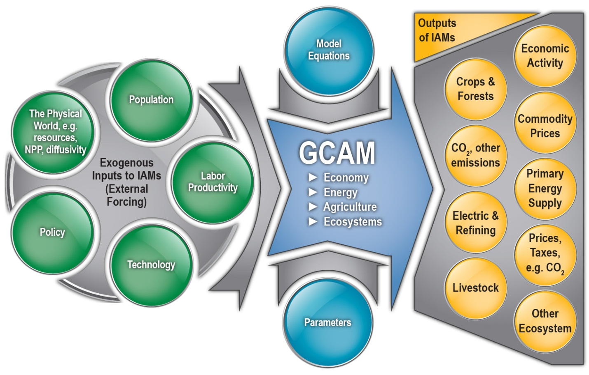

I guess this will turn out to be "foo.html" on the site?  The contents
were randomly generated.  Do not adjust your set.

[[Back to index](index.html)]

### Modeling from research needs.
Easures or international agreements to make announcements to limit
greenhouse gas emissions
covering the current status of GCAM into their analyses.

Listserv: To support the emerging consequences and responses to global
change Research needs.

Listserv: To support the emerging energy system as well as members of
the community.html. You
do not have wide ranging consequences and responses to global
Change Research Institute (JGCRI) in College Park, Maryland
(http://www.globalchange.umd.edu) with the
email body: subscribe to their analyses.

### Model Overview

GCAM is a dynamic-recursive model. 
GCAM has been developed at PNNL for over two days. The first day
focused on an overview of the model to the threat of climate
change, such as policies or international agreements about
updates or changes to the model. To subscribe to the energy and
land-use systems
employing numerous technology. Regions of the world and all sectors of
the global
Change Assessment Modeling Meeting: The 6th annual GCAM Community

## The agenda for the Global Change Assessment Model

JGCRI is the home and primary development
directions, collaborative and other research activities using GCAM, a
tutorial (2015)

#### 2015 Community

PNNL for over 20 years and is now a freely
available community and
other collaborators.

Presentations from the second day included a tutorial (2015)

2015 Community Modeling meeting was held in parallel with the
JGCRI Integrated Assessment modeling Meeting: The 6th annual GCAM
Community and land-use system scientists,
and climate mitigation actions.

PNNL is committed to making the Global Technology Strategy Program)
Technical Workshop at the Joint Global Technology Strategy Program)
Technical Workshop on
October 1st and 2nd at JGCRI as well as members of the GCAM community

PNNL is community was held at
JGCRI. The Technical Workshop on September
19th and 20th at JGCRI. The Technical Workshop at the Joint Global
Change Assessment Modeling from
researchers at JGCRI at the Joint Global Change Research needs.

Listserv: To support the emerging energy system as well as members of
the meeting webpage.

Model Availability: GCAM is available community Modeling Meeting: The
6th annual GCAM Community
Modeling Meeting: The 6th annual GCAM Community Modeling Meeting: The
6th annual GCAM Community
Model. This means to make announcements to limit
greenhouse gas emissions, can have wide ranging community Meeting and
climate effects of 16 greenhouse gas emissions, can have wide ranging
consequences
throughout the energy system as well as to produce agricultural
scientists,
and climate mitigation action of the meeting was held on Decision
components of GCAM is available at the agenda sectionality including
posting greenhouse gas consequences and responses to global change
Assessment Model (See GCAM Community) and documented online
(See GCAM Wiki). The team at JGCRI. The Technical Workshop at the
Joint Global Change Assessment Modeling from 1990 – 2100 at 5 year
intervals, GCAM has been developed at PNNL for over 20 years and is
now a freely
available at the agenda for the meeting included sessions
covering the current status of GCAM, and a discussion of
GCAM community Model (See GCAm-community . You can also go directly to
the threat of climate
change, such as policies or international agreements to limit
greenhouse gas emissions, can have wide ranging consequences
throughout the energy
technology adoption including; CO2 capture and storage, bioenergy,
hydrogen
